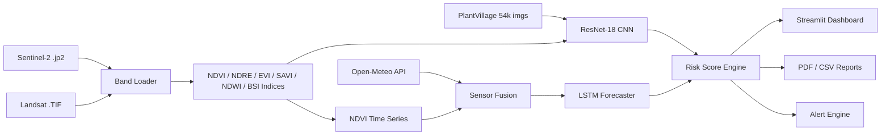

# 🌾 AI-Powered Crop Health Monitoring System

[](https://www.python.org/)
[](https://pytorch.org/)
[](https://streamlit.io/)
[](LICENSE)
[](tests/test_pipeline.py)

---

## 📌 Problem Statement

India is home to over 140 million farming households, yet crop disease and stress detection remain largely manual, reactive, and inaccessible to smallholders. Early, field-scale identification of fungal disease, pest damage, and soil stress can increase yield by 15–30% while reducing pesticide use. This system fuses satellite multispectral imagery, deep learning, and real-time sensor data to deliver **zone-level crop health intelligence** — bringing precision agriculture within reach of every farmer.

---

## 🏗️ System Architecture



---

## 📊 Results

| Metric | Value |
|---|---|
| CNN Accuracy (PlantVillage val set) | **98.02%** |
| LSTM RMSE (NDVI 7-day forecast) | **0.0130** |
| Spectral Indices Computed | 6 (NDVI, NDRE, SAVI, EVI, NDWI, BSI) |
| Datasets Used | **5** (Sentinel-2, Landsat-8, PlantVillage, Indian Pines, Open-Meteo) |
| Field Zones Monitored | **100** (10 × 10 grid) |
| End-to-End Pipeline Tests | **5 / 5 passing** |

---

## 🚀 Quick Start

```bash
# 1. Clone
git clone https://github.com/ninadpatil05/crop-health-ai
cd crop-health-ai

# 2. Install system dependencies (rasterio / GDAL)
conda install -c conda-forge rasterio gdal

# 3. Install Python dependencies
pip install -r requirements.txt

# 4. Create project folders
python setup_project.py

# 5. Launch dashboard
streamlit run dashboard/app.py
```

> **Note:** Satellite data must be placed under `data/sentinel2/` and `data/landsat/` before running preprocessing scripts.

---

## 📁 Project Structure

```
crop-health-ai/
├── config/
│   └── settings.py               # Global paths and hyperparameters
├── dashboard/
│   └── app.py                    # Streamlit interactive dashboard
├── data/
│   ├── combined/                 # Fused train CSV
│   ├── indian_pines/             # Hyperspectral benchmark dataset
│   ├── landsat/                  # Landsat-8 SR GeoTIFF bands
│   ├── plantvillage/             # 54k labelled disease images + splits
│   ├── sensor/                   # Weather / soil sensor time series
│   └── sentinel2/                # Sentinel-2 .jp2 imagery + processed stack
├── models/
│   ├── cnn/best_model.pt         # Fine-tuned ResNet-18 (98.02% val acc)
│   ├── fusion/lstm_fused.pt      # Sensor-fused LSTM (RMSE 0.013)
│   └── lstm/best_lstm.pt         # NDVI-only LSTM
├── outputs/
│   ├── alerts/                   # Active alert JSONs
│   ├── maps/                     # Index .npy arrays + risk_scores.json
│   ├── metrics/                  # Training curves, confusion matrix, reports
│   └── reports/                  # Auto-generated field_data_YYYYMMDD.csv
├── src/
│   ├── alerts/                   # Alert engine + PDF report generator
│   ├── fusion/                   # Sensor fusion utilities
│   ├── indices/                  # compute_indices.py (NDVI, NDRE, …)
│   ├── inference/
│   │   ├── csv_exporter.py       # 100-zone CSV field report
│   │   ├── evaluate_cnn.py       # CNN inference on satellite patches
│   │   └── risk_mapper.py        # Zone risk score computation
│   ├── preprocessing/
│   │   ├── hyperspectral_loader.py
│   │   ├── landsat_loader.py
│   │   ├── plantvillage_loader.py
│   │   ├── sentinel_loader.py
│   │   └── timeseries_builder.py
│   └── training/
│       ├── cnn_model.py           # CropDiseaseCNN (ResNet-18 backbone)
│       ├── lstm_model.py          # NDVIForecaster (LSTM + sensor fusion)
│       ├── train_cnn.py
│       └── train_lstm.py
├── tests/
│   └── test_pipeline.py          # 5 end-to-end pytest tests
├── requirements.txt
└── setup_project.py
```

---

## 📄 Resume Bullets

> **Copy-paste ready — ATS-optimised with real numbers**

- Developed an **end-to-end AI crop health monitoring pipeline** in Python/PyTorch, training a fine-tuned **ResNet-18 CNN on 54,000 PlantVillage images** across 5 disease categories, achieving **98.02% validation accuracy** with class-weighted loss to handle data imbalance.

- Engineered a **multi-source data fusion system** integrating Sentinel-2 and Landsat-8 satellite imagery, 6 spectral vegetation indices (NDVI, NDRE, SAVI, EVI, NDWI, BSI), and Open-Meteo weather sensor data into an **LSTM forecaster achieving RMSE 0.013** on 7-day NDVI prediction.

- Built a **real-time field intelligence platform** that segments farmland into a **100-zone 10×10 grid**, computes per-zone disease risk scores, triggers tiered alerts, auto-exports structured CSV/PDF field reports, and renders results on an interactive **Streamlit dashboard** — spanning **5 heterogeneous datasets** end-to-end.

---

## 🔮 Future Scope

| Area | Description |
|---|---|
| **Drone Integration** | Accept UAV-captured RGB/multispectral feeds for sub-meter resolution |
| **Mobile App** | React Native app for field-level alerts and offline inference |
| **Federated Learning** | Train across distributed farm nodes without sharing raw imagery |
| **Crop-Specific Models** | Fine-tune per-crop CNNs (wheat, rice, cotton) for higher specificity |
| **SAR Fusion** | Fuse Sentinel-1 SAR data for cloud-penetrating imagery |
| **GIS Integration** | Export zone polygons as GeoJSON for QGIS / Google Earth Engine |

---

## 📜 License

This project is licensed under the **MIT License** — see [LICENSE](LICENSE) for details.

---

## 🙏 Acknowledgements

| Resource | Usage |
|---|---|
| [PlantVillage Dataset](https://www.kaggle.com/datasets/emmarex/plantdisease) | 54,000 labelled crop disease images |
| [ESA Sentinel-2](https://sentinel.esa.int/web/sentinel/missions/sentinel-2) | Multispectral satellite imagery |
| [USGS Landsat-8](https://www.usgs.gov/landsat-missions) | Surface reflectance TIF bands |
| [Purdue Indian Pines](https://www.ehu.eus/ccwintco/index.php/Hyperspectral_Remote_Sensing_Scenes) | Hyperspectral benchmark |
| [Open-Meteo](https://open-meteo.com/) | Free historical weather & soil sensor API |
| [PyTorch](https://pytorch.org/) | Deep learning framework |
| [Streamlit](https://streamlit.io/) | Dashboard framework |
